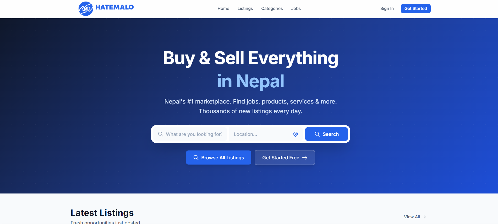

# Hatemalo — Nepal's Marketplace

> Nepal's first #1 marketplace and community for buying, selling, and connecting.

[](https://hatemalo.vercel.app)

**[🌐 https://hatemalo.vercel.app](https://hatemalo.vercel.app)**

---

## Screenshot

[](https://hatemalo.vercel.app)

---

Hatemalo is a full-stack web application that allows users to post, browse, and manage listings across dynamic categories. It features authentication, image uploads, location-based listing data, an admin panel, and a Progressive Web App (PWA) experience.

---

## Tech Stack

| Layer         | Technology                                       |
| ------------- | ------------------------------------------------ |
| Frontend      | React 19, Vite, Tailwind CSS v4, React Router v7 |
| Backend       | Node.js, Express v5                              |
| Database      | MongoDB (Mongoose)                               |
| Auth          | JWT (HTTP-only cookies), Google OAuth            |
| Image Storage | ImageKit                                         |
| Maps          | Leaflet / React-Leaflet                          |
| PWA           | vite-plugin-pwa, Workbox                         |
| Email         | Nodemailer + Mailgen                             |

---

## Project Structure

```
hatemalo/
├── backend/                  # Express API server
│   ├── src/
│   │   ├── controllers/      # Route handlers
│   │   ├── db/               # MongoDB connection
│   │   ├── middlewares/      # Auth, validation, upload
│   │   ├── models/           # Mongoose schemas
│   │   ├── routes/           # API route definitions
│   │   └── utils/            # Helpers (JWT, email, ImageKit, errors)
│   └── server.js             # Entry point
│
└── frontend/                 # React SPA
    ├── public/
    │   └── icons/            # PWA icons (48px – 512px)
    └── src/
        ├── components/       # Reusable UI, layout, maps, dynamic fields
        ├── context/          # Auth, Category, Listing contexts
        ├── pages/            # Route-level page components
        ├── router/           # React Router config
        ├── services/         # Axios API layer
        └── utils/            # Client-side helpers
```

---

## Getting Started

### Prerequisites

- Node.js ≥ 18
- MongoDB Atlas account (or local MongoDB)
- ImageKit account
- Google OAuth credentials

---

### Backend Setup

```bash
cd backend
npm install
```

Create a `.env` file inside `backend/`:

```env
NODE_ENV=development
PORT=5000

MONGO_URI=mongodb+srv://<user>:<db_password>@cluster.mongodb.net/hatemalo
DB_PASSWORD=your_db_password

JWT_SECRET=your_jwt_secret
JWT_EXPIRES_IN=7d
JWT_COOKIE_EXPIRES_IN=7

FRONTEND_URL=http://localhost:5173

IMAGEKIT_PUBLIC_KEY=your_imagekit_public_key
IMAGEKIT_PRIVATE_KEY=your_imagekit_private_key
IMAGEKIT_URL_ENDPOINT=https://ik.imagekit.io/your_id

GOOGLE_CLIENT_ID=your_google_client_id

EMAIL_HOST=smtp.example.com
EMAIL_PORT=587
EMAIL_USER=your_email@example.com
EMAIL_PASS=your_email_password
EMAIL_FROM=noreply@hatemalo.com
```

Start the backend:

```bash
# Development (with nodemon)
npm run dev

# Production
npm start
```

The API will be available at `http://localhost:5000/api/v1`.

---

### Frontend Setup

```bash
cd frontend
npm install
```

Create a `.env` file inside `frontend/`:

```env
VITE_API_URL=http://localhost:5000/api/v1
VITE_IMAGEKIT_PUBLIC_KEY=your_imagekit_public_key
VITE_IMAGEKIT_URL_ENDPOINT=https://ik.imagekit.io/your_id
VITE_GOOGLE_CLIENT_ID=your_google_client_id
```

Start the frontend:

```bash
# Development
npm run dev

# Production build
npm run build

# Preview production build locally
npm run preview
```

The app will be available at `http://localhost:5173`.

---

## API Overview

| Method | Endpoint                              | Description                     |
| ------ | ------------------------------------- | ------------------------------- |
| POST   | `/api/v1/auth/register`               | Register new user               |
| POST   | `/api/v1/auth/login`                  | Login                           |
| POST   | `/api/v1/auth/logout`                 | Logout                          |
| GET    | `/api/v1/auth/verify-email/:token`    | Verify email                    |
| GET    | `/api/v1/category`                    | Get all categories              |
| GET    | `/api/v1/category-config/:categoryId` | Get dynamic fields config       |
| GET    | `/api/v1/listings`                    | Get all listings (with filters) |
| POST   | `/api/v1/listings`                    | Create listing (auth required)  |
| GET    | `/api/v1/listings/:slug`              | Get single listing              |
| PATCH  | `/api/v1/listings/:id`                | Update listing                  |
| DELETE | `/api/v1/listings/:id`                | Delete listing                  |
| GET    | `/api/v1/users/me`                    | Get current user profile        |
| PATCH  | `/api/v1/users/update-me`             | Update profile                  |

---

## PWA

The app is installable as a Progressive Web App on both Android and iOS devices.

- Service worker is auto-registered via `vite-plugin-pwa` + Workbox
- Precaches all static assets on install
- Google Fonts are cached with a `CacheFirst` strategy
- App icons are provided in sizes: 48, 72, 96, 128, 144, 152, 192, 256, 384, 512 px

---

## Scripts

### Backend

| Command       | Description                      |
| ------------- | -------------------------------- |
| `npm run dev` | Start with nodemon (development) |
| `npm start`   | Start in production mode         |

### Frontend

| Command           | Description              |
| ----------------- | ------------------------ |
| `npm run dev`     | Start Vite dev server    |
| `npm run build`   | Production build         |
| `npm run preview` | Preview production build |
| `npm run lint`    | Run ESLint               |

---

## License

ISC © [Dhiraj Gurung](https://github.com/dhirajgurung)
